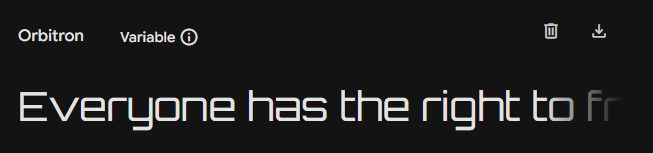
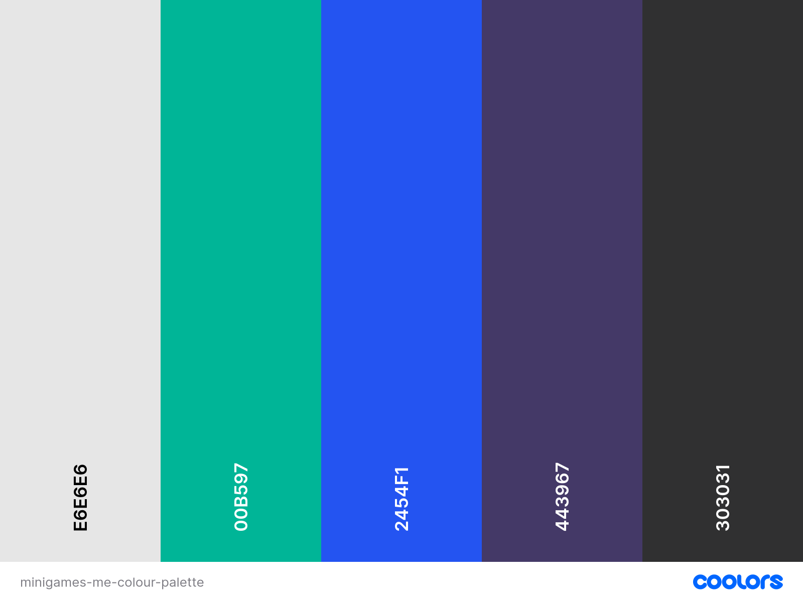
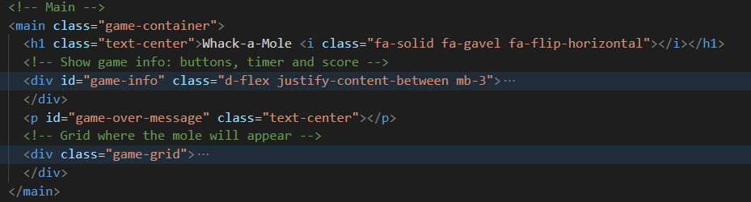
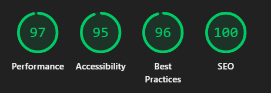
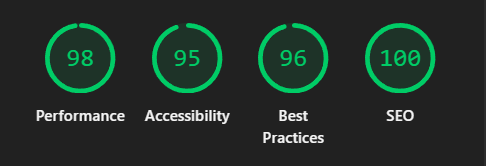
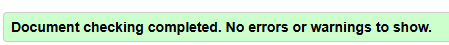
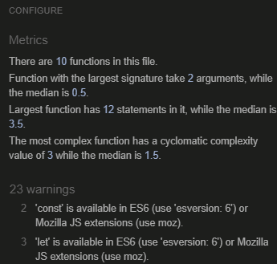
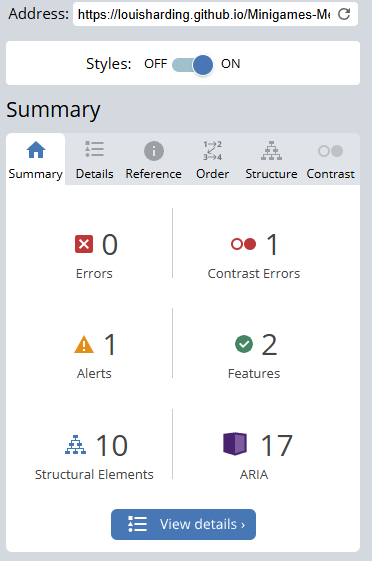

# Minigames-Me

Minigames-Me is a multipage website featuring in-browser playable games.

The website is designed with simplicity and access as a main focus, demonstrating frontend skills including bootstrap.

## Features

- Homepage with multiple games
- Sitewide navigation bar
- Responsive design
- Accessible design

## Design and Planning:
### Typography
This font was chosen for a sci-fi / futuristic / space theme.



### Colour Scheme
Colour palette pulled from the finished website.



### Images and Icons

##### Whack-a-mole:
The mole image used in whack-a-mole was generated with the help of chatgpt.


## Development
### Whack-a-mole
##### HTML:
The minigame was added into a main ```class="game-container"``` which was used across the site, this ensured reusability and made sure the games have similar styles and layouts to make the user experience uniform.



##### Styling:
Originally this had a seperate css file that included root variables:
```
:root {
  --mole-bg: burlywood;
  --tile-bg: lightgreen;
  --tile-size: 200px;
  --grid-size: 612px;
  --border: 2px solid #222; 
```
which were applied across a whack-a-mole.css file. However it was removed as the variables were not used often and the file was merged into the main style.css file.

##### JavaScript:
The main functionality of the minigame is shown in this code snippet:
```
// Set an interval to move the mole every x seconds
function moveMole() {
    // Make sure the game is active before moving the mole
    if (isGameActive) {
        moleInterval = setInterval(getRandomTile, convertToMilliseconds(moveMoleInterval));
    }
}

// Loop through grids with class "tile", 
// pick a random tile for the mole css class to be added
function getRandomTile() {
    const chosenTile = getRandomNumber(gridSize);

    // Remove any existing mole class in tiles
    for (const tile of gridTiles) {
        tile.classList.remove('mole');
    }
    gridTiles[chosenTile].classList.add('mole');
}
```
The snippet shows a ```.mole``` class being added and removed. The class in the css file includes a background image of the mole:

```background-image: url(../images/mole.webp``` 

This was created as it was the easiest way to make the mole appear and disappear for the minigame.

The idea for having a mole class being added and removed was taked from this  
[video.](https://www.youtube.com/watch?v=lhNdUVh3qCc)

### Tile-Pairs
This game gives the user a grid of customizable size. Each cell's value is hidden and they can only reveal two at a time. By using their memory and revealing two of the same type, those cells stay revealed. The game is won by revealing all the cells.

The CreateGrid function creates the grid of cells the user sees.

The values in the cells need to range from 1 to half (x-width * y-width), with each value repeating once. These numbers are created in CreatePairsArray function.


## Testing
### Google's Lighthouse Performance
The page was tested in incognito mode in Google Chrome.

#### Mobile:
##### Whack-a-mole:



#### Desktop:
##### Whack-a-mole:



### Code Validation
[HTML Validation](https://validator.w3.org/)

#### Whack-a-mole:
While there were some comments about a ```/>``` being used at the end of some elements no other errors were shown.




[CSS Validation](https://jigsaw.w3.org/css-validator/)


[JavaScript validation](https://jshint.com/)
#### Whack-a-mole:
Although JSHint shows 23 warnings it is to do with ES version configuration and is not a problem with the code. 




### WAVE Acessibility
[WAVE - Web Accessibility Evaluation Tool](https://wave.webaim.org/)

#### Whack-a-mole:




### Browser Compatability
The has been run on Google Chrome, Microsoft Edge and Mozilla Firefox. All which run well and as intended.


## AI Use & Reflection
Some use of AI was with documentaion and helping to add comments on code. While some of the comments it suggested was a little complicated, it was easy to ask the AI to shorten the code. Additionally, it was good to use it as an example of how to write the comment myself.

AI was also used to help quickly find bugs in the code. It was not always correct with where the bug was in the code but it provided suggestions on where the problem could be as well as how to fix it, which helped with workflow as it shorted time needed to fix them.

### Reflection
While the use of AI helped to improve on workflow and quickly find small bugs; some of the suggestions given did not help at all or were confusing. Thus it wasn't used as it was important to write code that was easy to understand. 

## Deployment
Early deployment of the site was done for ease of development as the project progressed.
#### Deloying on Github:
The site was deployed to Github Pages using the following method:
- Go to the Github repository.
- Navigate to the 'settings' tab.
- Got to Pages > Build and deployment
- Make sure Source is set to 'Deploy from a branch"
- In Branch, dropdown menu, choose 'main'.
- Click 'save'.
- Refresh the page.
- Click the 'Visit site' which will open the deployed page in a new tab. (This may take a few minutes).

View the deployed site [here.](https://louisharding.github.io/Minigames-Me/)

## Authors

- [@Khizermalik1](https://github.com/khizermalik1)

- [@KoroYsabela](https://github.com/KoroYsabela)

- [@ETCocoa](https://github.com/ETCocoa)

- [@SSR-001](https://github.com/SSR-001)

- [@louisharding](https://github.com/louisharding)

## Credits

ChatGPT generated the icons for the Rock Paper Scissors game.

##### Colour Flipper:
The small minigame was created with the help of this [video.](https://www.youtube.com/watch?v=3PHXvlpOkf4&t=421s)


